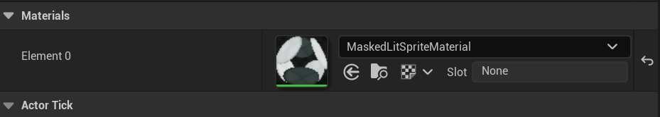
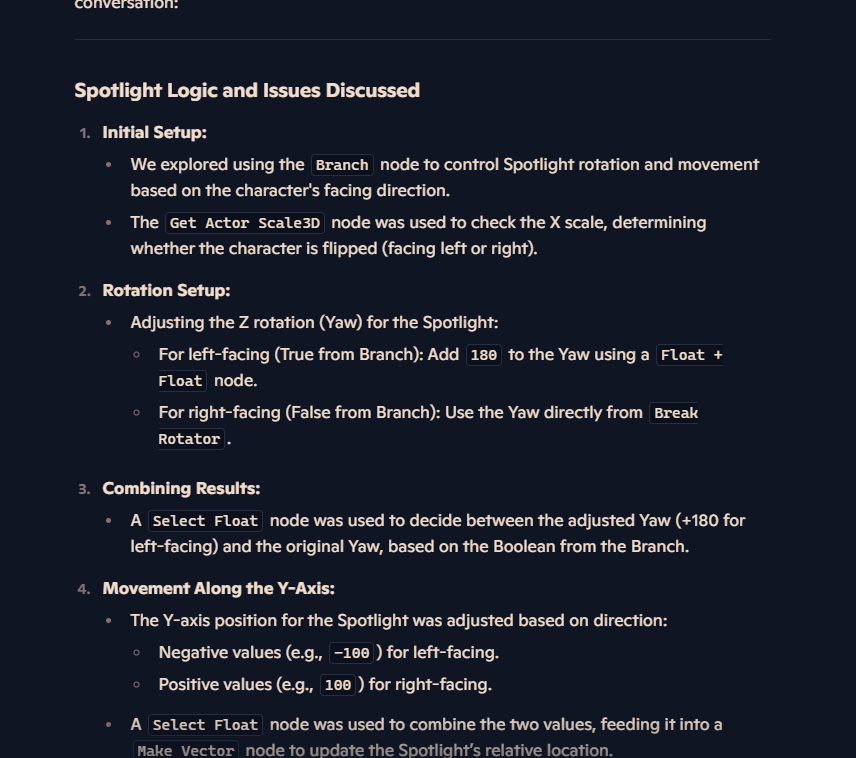
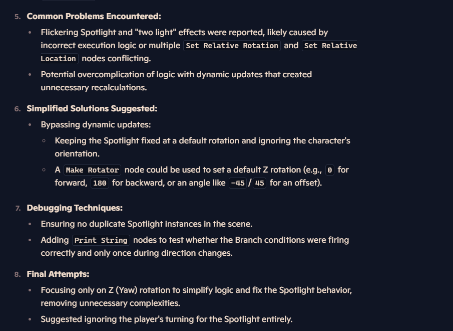

# Development Commentary Template

## Project Outline
- ~~At Death We Part is a 2.5D platformer with light and dark mechanics to help the player progress in the story. There is two characters one who has light powers and can only stand in light, and the other who has dark powers and can only stand in darkness.~~ 

- At Death we part is a 2.5D Platformer that utalises light and dark mechanics to help the player progress through the level. The character will have two states; A light state and a dark state, this allows the player to pass through the shadow areas whislt in the dark state and the light areas whist in the dark state. This then allows the player to stand on platforms of the oppisite state (Light character can stand on the dark areas and vise versa).

- My inital goal is to create a functional swapping mechanic for the player that I can then add to by adding powers to the different states and the making puzzles around that. Then after that is completed I will then add more mechanics and polish to the game.    

- The most immediate challange I may face is making the light mechanic work and only light up the part of the platform it is touching. Another issue may be miscommunication from teammembers.  

## Research

### Methodology  

### Game Sources  
- Ori and the Blind Forest:
Ori is a 2.5 Platformer game where the main character 'Ori' traverses through the world gaining powerups as he goes. I found the 2.5D artstyle to look very interesting with this almost storybook looking artstyle.

- "Ori and the Blind Forest's gameplay combines platformer elements with open-world exporation (metroidvania). Players control Ori who can jump, run on walls and use various abilities to overcome obstacles and fight enemies."
Find Sources that talk about oris gameplay mechanics."

(ProgKids, 2025)

- Inside:
Inside is a 2.5D game where the player must travel though a bleak empty world to using the environment to put together the story and figure out the characters objective.

“Sequences were often shuffled around, broken apart and recombined to suit the evolution of the story and to make sure that mechanics and visual cues were shown to the player in the correct order, setting up subsequent encounters,” says Bogdan.

(Wiltshire, 2017)

### Academic Sources  
- Research academic papers, books, or articles that provide theoretical guidance for your project. Include a brief summary of each source.  
- Describe how the academic research applies to your project and shapes your design and development decisions.

### Documentation Sources  

## Floating Animation

<iframe width="560" height="315" src="https://www.youtube.com/embed/mGPIehrzauM?si=9W5hKkquwyqF04Yk" title="YouTube video player" frameborder="0" allow="accelerometer; autoplay; clipboard-write; encrypted-media; gyroscope; picture-in-picture; web-share" referrerpolicy="strict-origin-when-cross-origin" allowfullscreen></iframe>

## Camera Mechanic
<iframe width="560" height="315" src="https://www.youtube.com/embed/ZmIzHtglnMM?si=jhqRReVfk8Fhn_sV" title="YouTube video player" frameborder="0" allow="accelerometer; autoplay; clipboard-write; encrypted-media; gyroscope; picture-in-picture; web-share" referrerpolicy="strict-origin-when-cross-origin" allowfullscreen></iframe>

<iframe width="560" height="315" src="https://www.youtube.com/embed/O7SjrIrY_io?si=xUh4iTc1JVeLD4Mm" title="YouTube video player" frameborder="0" allow="accelerometer; autoplay; clipboard-write; encrypted-media; gyroscope; picture-in-picture; web-share" referrerpolicy="strict-origin-when-cross-origin" allowfullscreen></iframe>

## 2D Movement
<iframe width="560" height="315" src="https://www.youtube.com/embed/0f1_qSXbqAI?si=NKyjGC-tFWcnW6Yd" title="YouTube video player" frameborder="0" allow="accelerometer; autoplay; clipboard-write; encrypted-media; gyroscope; picture-in-picture; web-share" referrerpolicy="strict-origin-when-cross-origin" allowfullscreen></iframe>

## Cursor Mechanic
<iframe width="560" height="315" src="https://www.youtube.com/embed/8VZtDdKApeM?si=ow2RlVm7CmGLkJtF" title="YouTube video player" frameborder="0" allow="accelerometer; autoplay; clipboard-write; encrypted-media; gyroscope; picture-in-picture; web-share" referrerpolicy="strict-origin-when-cross-origin" allowfullscreen></iframe>

- Investigate relevant documentation, tutorials, or instructional videos that provide technical insights into your tasks. Summarise the content and its relevance to your project.  
- Explain how this technical knowledge supports your project work and guides your decision-making process.

## Shadow Platform Mechanic

<iframe width="560" height="315" src="https://www.youtube.com/embed/T3Vou11FGss?si=nQEo29AhNXc_3S8e" title="YouTube video player" frameborder="0" allow="accelerometer; autoplay; clipboard-write; encrypted-media; gyroscope; picture-in-picture; web-share" referrerpolicy="strict-origin-when-cross-origin" allowfullscreen></iframe>

## Light Dash Mechanic

<iframe width="560" height="315" src="https://www.youtube.com/embed/nV_JGMNRGpc?si=WBpZ5adjccfrnpQZ" title="YouTube video player" frameborder="0" allow="accelerometer; autoplay; clipboard-write; encrypted-media; gyroscope; picture-in-picture; web-share" referrerpolicy="strict-origin-when-cross-origin" allowfullscreen></iframe>

## Moving Spline Platforms

<iframe width="560" height="315" src="https://www.youtube.com/embed/fm0_W6YV_8k?si=oN2JOLi6XQ-FmMEL" title="YouTube video player" frameborder="0" allow="accelerometer; autoplay; clipboard-write; encrypted-media; gyroscope; picture-in-picture; web-share" referrerpolicy="strict-origin-when-cross-origin" allowfullscreen></iframe>

## Credits Screen

<iframe width="560" height="315" src="https://www.youtube.com/embed/LmLjLQbyq-4?si=MWRgjL0kuGvImjc4" title="YouTube video player" frameborder="0" allow="accelerometer; autoplay; clipboard-write; encrypted-media; gyroscope; picture-in-picture; web-share" referrerpolicy="strict-origin-when-cross-origin" allowfullscreen></iframe>

## Main Menu / Settings

<iframe width="560" height="315" src="https://www.youtube.com/embed/Ff67XtqgSxc?si=oO6rh08KbM0fN9p2" title="YouTube video player" frameborder="0" allow="accelerometer; autoplay; clipboard-write; encrypted-media; gyroscope; picture-in-picture; web-share" referrerpolicy="strict-origin-when-cross-origin" allowfullscreen></iframe>

<iframe width="560" height="315" src="https://www.youtube.com/embed/Ff67XtqgSxc?si=W98w7lApiXjXsJDj" title="YouTube video player" frameborder="0" allow="accelerometer; autoplay; clipboard-write; encrypted-media; gyroscope; picture-in-picture; web-share" referrerpolicy="strict-origin-when-cross-origin" allowfullscreen></iframe>

## Jump Pad

<iframe width="560" height="315" src="https://www.youtube.com/embed/zkxCzJKrV2s?si=4njGgqhNJN-uhFPn" title="YouTube video player" frameborder="0" allow="accelerometer; autoplay; clipboard-write; encrypted-media; gyroscope; picture-in-picture; web-share" referrerpolicy="strict-origin-when-cross-origin" allowfullscreen></iframe>

## Door / Key Mechanic

<iframe width="560" height="315" src="https://www.youtube.com/embed/Bcle9sSS4Oo?si=iO3Ezj4QdcWu2aKI" title="YouTube video player" frameborder="0" allow="accelerometer; autoplay; clipboard-write; encrypted-media; gyroscope; picture-in-picture; web-share" referrerpolicy="strict-origin-when-cross-origin" allowfullscreen></iframe>

## Dialogue System

<iframe width="560" height="315" src="https://www.youtube.com/embed/Z8q1eMU2Gjo?si=zVv5vuLgB69yGFrY" title="YouTube video player" frameborder="0" allow="accelerometer; autoplay; clipboard-write; encrypted-media; gyroscope; picture-in-picture; web-share" referrerpolicy="strict-origin-when-cross-origin" allowfullscreen></iframe>

## Flashlight Mechanic

<iframe width="560" height="315" src="https://www.youtube.com/embed/Fn9M77PW9oA?si=tIso0J9xniW0LeTS" title="YouTube video player" frameborder="0" allow="accelerometer; autoplay; clipboard-write; encrypted-media; gyroscope; picture-in-picture; web-share" referrerpolicy="strict-origin-when-cross-origin" allowfullscreen></iframe>

## Implementation

# Camera Mechanic

- For the Camera Mechanic I want the camera to be on a static spline, when the player leaves the room the camera will fly to the next room.
-

<iframe width="560" height="315" src="https://www.youtube.com/embed/gBBOPRDMu6s?si=5iegBYA7dNeLJ3ra" title="YouTube video player" frameborder="0" allow="accelerometer; autoplay; clipboard-write; encrypted-media; gyroscope; picture-in-picture; web-share" referrerpolicy="strict-origin-when-cross-origin" allowfullscreen></iframe>

- I fixed the way the camera was facing but now I need to make it so the camera is segmented.

<iframe width="560" height="315" src="https://www.youtube.com/embed/w-KmBBzDxT4?si=xCTGsWQlqA5D_sYK" title="YouTube video player" frameborder="0" allow="accelerometer; autoplay; clipboard-write; encrypted-media; gyroscope; picture-in-picture; web-share" referrerpolicy="strict-origin-when-cross-origin" allowfullscreen></iframe>

- Spline Movement BP:
<iframe src="https://blueprintue.com/render/d6-zmgms/" scrolling="no" allowfullscreen></iframe>

- I wasn't a fan of how this looked so I used the Residant Evil camera system as a reference and implemented it into the game.

<iframe width="560" height="315" src="https://www.youtube.com/embed/UTj87aCSJpA?si=NK0UW5SZVROZyuN1" title="YouTube video player" frameborder="0" allow="accelerometer; autoplay; clipboard-write; encrypted-media; gyroscope; picture-in-picture; web-share" referrerpolicy="strict-origin-when-cross-origin" allowfullscreen></iframe>

- I didnt like how the camera moved so I disabled the movement and made the camera completly static.

<iframe width="560" height="315" src="https://www.youtube.com/embed/78SvbqNOx20?si=eJhKqkQgd9OX1Gfr" title="YouTube video player" frameborder="0" allow="accelerometer; autoplay; clipboard-write; encrypted-media; gyroscope; picture-in-picture; web-share" referrerpolicy="strict-origin-when-cross-origin" allowfullscreen></iframe>

- Later on the designer changed the old system to a spine camera system where the camera moves to different set of prepositioned points. This allows the player to experience smooth camera transitions instead of my snappier ones.

<iframe width="560" height="315" src="https://www.youtube.com/embed/bRS4t7PGh1k?si=6P62JbOtYXHr9uGi" title="YouTube video player" frameborder="0" allow="accelerometer; autoplay; clipboard-write; encrypted-media; gyroscope; picture-in-picture; web-share" referrerpolicy="strict-origin-when-cross-origin" allowfullscreen></iframe>

# 2D Movement & Animation

 - I decided to remake the old third person character template with a 2D one created by the artist of the group. This new 2D character is a better fit for the 2.5D astetic that we are going for in this game.
 - I animated this character by using the paperZD plugin (Critical Failure Studio, 2017.) which allows for easier implementation of 2D characters.
 - To implement the character into a PaperZDCharacter class I first made the sprites into a flipbook and animated it changed the frame every 6 frames for 15 frames.

<iframe width="560" height="315" src="https://www.youtube.com/embed/n-XqGaaHGAM?si=dYtgSdPJiM6dCh2v" title="YouTube video player" frameborder="0" allow="accelerometer; autoplay; clipboard-write; encrypted-media; gyroscope; picture-in-picture; web-share" referrerpolicy="strict-origin-when-cross-origin" allowfullscreen></iframe>
 

 ### Animation Preview

<iframe width="560" height="315" src="https://www.youtube.com/embed/LIjhmgG4hJA?si=Hrj6u3ph35NmVNHG" title="YouTube video player" frameborder="0" allow="accelerometer; autoplay; clipboard-write; encrypted-media; gyroscope; picture-in-picture; web-share" referrerpolicy="strict-origin-when-cross-origin" allowfullscreen></iframe>

- I Added the new sprite to the Player_BP
- To make the lighting more releastic I added cast shadow in the details tab, this will make the lighting look more realistic on the character.
- To ensure that this works in the matarials I added a MaskedLitSpriteMaterial so that the light works on the character correctly.

## Flash Light System

- I was looking into creating a 2D flashlight for the game but I was unsure how to impliment it so I looked at copilot to help me learn about how to create it.

- After tweaking the flashlight I managed to make it work correctly when the player turns left.

<iframe width="560" height="315" src="https://www.youtube.com/embed/gpnFGT_jYT0?si=hJIuUY5tdEdjAvWb" title="YouTube video player" frameborder="0" allow="accelerometer; autoplay; clipboard-write; encrypted-media; gyroscope; picture-in-picture; web-share" referrerpolicy="strict-origin-when-cross-origin" allowfullscreen></iframe>

## Flickering Light System
- for a simple puzzle idea I created a light that toggles every 3 seconds.

<iframe width="560" height="315" src="https://www.youtube.com/embed/nydL_rrPxJU?si=iSorcX9ErV-XIV3J" title="YouTube video player" frameborder="0" allow="accelerometer; autoplay; clipboard-write; encrypted-media; gyroscope; picture-in-picture; web-share" referrerpolicy="strict-origin-when-cross-origin" allowfullscreen></iframe>

## Cursor mechanic
- To make the game feel more stylisied I added a custom cursor to the game, this step was easy but I am eventually going to make the cursor change when clicked to be more visual.

## Animated shadow texture 
- I animated a simple animation for the shadow platforms. I requested for the shadow to look more like squiggles, this helps the game to look more like a picture book that had been drawn into.

- I used Copilot to give me an idea of how to smoothly cycle between the frames so it looks like the squiggles are moving rather than switching in between frames.

## Shadow Platform Mechanic

## Light Dash Mechanic

## Moving Spline Platforms

## Credits Screen

## Main Menu

## Jump Pad

## Flying Ghost AI

## Ground Ghost

## Button Mechanic

## Door / Key Mechanic

## Dialogue System

### New Approaches  

## Light System
- Due to time constraints and being repeatedly let down by my designer I had to remake the entire game idea from scratch whilst trying to keep the overall theme of loss and acceptence in tact. Instead of having 5 levels there will now be one giant level with 3 sections (attic, bedroom, basement) and the movement controls and mechanics have been simplified indefinitely or when we meet schecule deadlines. This change was unfortunate as I wanted to trust the designers reassurance that he would get everything done on time, however, they never delivered. I have also diminished the designers rights and I am now acting as lead designer and I have stationed the old designer to doing backround assets and sound design.

## Camera System
- originally the player camera was going to be static and fly to the next room when the player walked into it, However, I found the spline to be finicky so I gave the camera a more standard look. If I have some spare time I will look into creating it again. But for now the camera works as intended. 
- Detail any innovative or new approaches you explored during the project.  
- Explain why these approaches were chosen and how they differ from standard practices.  
- Evaluate the success of these approaches, including any challenges faced and lessons learned.

## 2 player system

- I have scrapped the 2 player system and instead I have one sprite followed by a small ghost to give the same effect.

### Testing
- Document the user testing conducted, specifying the type of tests used (e.g., automated testing, guided user testing, blind testing).  
- Present feedback or issues identified during testing, using graphs, tables, or visual aids to summarise results.  
- Describe how these issues were addressed. If any issues were not resolved, provide a clear justification for leaving them unaddressed.

## Technical Difficulties

## Camera System

- The camera is not looking at the correct location, cannot rotate camera
- Identify any technical difficulties encountered during the implementation phase.  
- I was having an issue of being able to turn the camera even though the game was in 2D making the movement controls weird. This was a simple fix I just added the mouse onto the screen all the time to disable camera movement. It is also set up for the power mechanics which will need the mouse to operate.

<iframe src="https://blueprintue.com/render/d6-zmgms/" scrolling="no" allowfullscreen></iframe>

- Provide details on how these issues were diagnosed and resolved.  
- If any difficulties remain unresolved, explain the impact on the project and any mitigation strategies used to minimise their effect.  
- Reflect on what you would do differently in future projects to avoid similar issues.

## Flash Light System
- After asking Copilot to help me create a Flashlight I noticed a bug, the code would work perfectly when I turned to face the left the code would not work as intended.

<iframe width="560" height="315" src="https://www.youtube.com/embed/i1m2L-XBxxM?si=4aWbxsiQ99065Ak3" title="YouTube video player" frameborder="0" allow="accelerometer; autoplay; clipboard-write; encrypted-media; gyroscope; picture-in-picture; web-share" referrerpolicy="strict-origin-when-cross-origin" allowfullscreen></iframe>
## Outcomes

### Source Code/Project Files
- Provide a link to your complete source code or project files.  
- Ensure the link is publicly accessible or shared with the appropriate permissions.  
- Include a brief description of the files provided, highlighting key components or any instructions required to run the project.

### Build Link
- Share a link to a playable or executable build of your project.  
- Ensure the build is accessible across relevant platforms and is publicly accessible.  
- Include any necessary instructions for running the build, such as system requirements or installation steps.

### Video Demonstration

<iframe width="560" height="315" src="https://www.youtube.com/embed/vRedYt10UQk?si=U3wlJzXxRol5LBZO" title="YouTube video player" frameborder="0" allow="accelerometer; autoplay; clipboard-write; encrypted-media; gyroscope; picture-in-picture; web-share" referrerpolicy="strict-origin-when-cross-origin" allowfullscreen></iframe>

## Reflection
- After working in a group I realised that choosing reliable team members is a must, having just one team member not play their part can have a devastating effect on the production progress and put more work onto my plate in the longrun. After some thought my next game will be a solo project and I may use the original idea of my prototype.

- I should have also stopped putting off work as it added more work for me later on, causing delays for the timeline I had set for myself.

### Research Effectiveness  
- Assess the usefulness of the research conducted during the project.  
- Highlight which sources (games, academic, documentation) had the most significant impact on your work and explain why.  
- Identify any research gaps or areas where additional information could have improved your project outcomes.

### Positive Analysis 
- I enjoyed working on this project applying what i know into the project to create a better and more efficient game then I would have been able to do before.

- I liked the challenge of creating a 2.5D game as it allowed me to learn how to do some things differently such as, changing the camera and movement systems.

- (Add Screenshots and other sources)

### Group Positive Analysis
- Working as a group has been positive in some ways as it is nice to give everyone their designated tasks to help split the workload as a whole.

- I enjoyed managing my group and giving them different asignments to help improve the game, from asking my artist to create different assets that will help improve the games overall storytelling, to asking my designer to create music using the different themes and instruments I chose to make the music more immersive and emotional.

- (add screenshots and other sources to help prove these statements)

### Negative Analysis
- Working on this project has taught me about the importance of team communication, as I have learned that miscommunication or missed group deadlines can almost halt the team workflow.

- During this project I took on the role of a unofficial team leader, I didn't feel confident in this role and found it increased my workload quite significantly. My initial thought that the game designer who created the original idea for the game would take on that role. However, the designer did not contribute as much to the project as i hoped he would. This lead to missed group deadlines that I organised, as well as tension within the group. To help the team workflow I reassigned the designer to simpler tasks. Such as, background level and audio design.   

- If I were to create this project again, I would make sure that the roles and responsibilities given out would better suit my team members to avoid missed deadlines and help communication.

### Next Time

- If I was to do this project again I would make sure that I chose team members that would do their part to ensure that the game is completed in a timely manner.

-I would have made sure that they would update the trello board often this time so I could better see where they were struggling or if they needed more time to do something.

- I Would also make sure the game would be less ambitious before as originally there were going to be five levels, which is possible but I need to consider things going wrong like it has here, then if I am ahead of scedule I could add stretch goals to help polish the game and make it more publishable.

- One thing I struggled with last time was documentation as I would just put everything I did into the notes making it unorganised and hard to find what I am looking for immedietly, costing me time that could be spent on working on the project.

## Bibliography  

- Aspland, Matt. n.d. “Door and Key System | How to Open A Locked Door with A Key in Unreal Engine 5 (Tutorial).” Youtube. Accessed May 17, 2025. https://www.youtube.com/watch?v=Bcle9sSS4Oo&list=LL&index=1.

- Aspland, Matt. n.d. “First Person Flashlight Leads the Camera in Unreal Engine 5 | More Immersive Flashlight (Tutorial).” Youtube. Accessed May 23, 2025. https://www.youtube.com/watch?v=Fn9M77PW9oA&t=195s.

- Aspland, Matt. n.d. “How to Create and Use A Custom Mouse Cursor in Unreal Engine 5 (Tutorial).” Youtube. Accessed May 16, 2025. https://www.youtube.com/watch?v=8VZtDdKApeM.

- Aspland, Matt. n.d. “How to Create A Physics Based Rope Swing System in Unreal Engine 5 (Tutorial).” Youtube. Accessed May 17, 2025. https://www.youtube.com/watch?v=zkxCzJKrV2s&list=LL&index=2&t=1968s.

- Aspland, Matt. n.d. “How to Create A Physics Based Rope Swing System in Unreal Engine 5 (Tutorial).” Youtube. Accessed May 22, 2025. https://www.youtube.com/watch?v=zkxCzJKrV2s&t=1968s.

- Aspland, Matt. n.d. “How to Make an Object Follow A Spline Path - Unreal Engine 5 Tutorial.” Youtube. Accessed May 17, 2025. https://www.youtube.com/watch?v=fm0_W6YV_8k&list=LL&index=3.

- Aspland, Matt. n.d. “How to Make A Spline-Based Side-Scroller Camera in Unreal Engine.” Youtube. Accessed May 16, 2025. https://www.youtube.com/watch?v=ZmIzHtglnMM.

- blueprintUE. n.d. Accessed May 16, 2025. https://blueprintue.com/..

- Bray, Titus. n.d. “Unreal Engine 2D Flipbooks | Beginner Tutorial.” Youtube. Accessed May 17, 2025. https://www.youtube.com/watch?v=3LsWb8pYg_s&list=LL&index=7.

- Bray, Titus. n.d. “Unreal Engine 2D Flipbooks | Beginner Tutorial.” Youtube. Accessed May 17, 2025. https://www.youtube.com/watch?v=3LsWb8pYg_s&list=LL&index=7.

- Code, Cobra. n.d. “Dodge Roll and Dash Step Movement - Unreal Engine 5 Tutorial.” Youtube. Accessed May 22, 2025. https://www.youtube.com/watch?v=nV_JGMNRGpc&t=83s.

- Contributor, Alex Wiltshire, and Alex Wiltshire. ‘How Inside’s Levels Were Designed.’ Rock, Paper, Shotgun, 12 May 2017. www.rockpapershotgun.com, https://www.rockpapershotgun.com/how-insides-levels-were-designed.. Accessed 7 April 2025.

- Critical Failure Studio. n.d. “PaperZD.” Accessed May 16, 2025. https://www.fab.com/listings/6664e3b5-e376-47aa-a0dd-f7bbbd5b93c0..

- GameDev, Ugur Batur. n.d. “Unreal Engine 5: Create a Resident Evil Style Camera System!” Youtube. Accessed May 16, 2025. https://www.youtube.com/watch?v=O7SjrIrY_io.

- Games, Gorka. n.d. “How to Make a Credits Menu in Unreal Engine 5.” Youtube. Accessed May 22, 2025. https://www.youtube.com/watch?v=LmLjLQbyq-4.

- Jax1m. n.d. “How to Spawn a Platform You Can Jump On - Unreal Engine Tutorial.” Youtube. Accessed May 22, 2025. https://www.youtube.com/watch?v=T3Vou11FGss&t=1096s.

- Learning by playing: Ori and the Blind Forest developer tips - ProgKids. https://www.progkids.com/en/blog/uchimsya-igraya-sovety-razrabotchikam-po-igre-ori-and-the-blind-forest.. Accessed 7 April 2025.

- OUVIO. n.d. “Paper ZD - How to Create a 2D Character in Unreal Engine 5.” Youtube. Accessed May 16, 2025. https://www.youtube.com/watch?v=0f1_qSXbqAI.

- Unreal, E. Z. n.d. “Unreal Engine 5 Tutorial: How to Create a Floating Object in Space - Make Object Go up & Down.” Youtube. Accessed May 22, 2025. https://www.youtube.com/watch?v=mGPIehrzauM.

- Unreal University. n.d. “How to Make A Dialogue System in Unreal Engine 5.” Youtube. Accessed May 17, 2025. https://www.youtube.com/watch?v=Z8q1eMU2Gjo&list=LL&index=5&t=1183s.

- Unreal University. n.d. “How to Make an Options Menu - Unreal Engine 5 Tutorial.” Youtube. Accessed May 22, 2025. https://www.youtube.com/watch?v=Ff67XtqgSxc.

- Unreal University. n.d. “How to Make an Options Menu - Unreal Engine 5 Tutorial.” Youtube. Accessed May 22, 2025. https://www.youtube.com/watch?v=Ff67XtqgSxc&t=103s.

- Critical Failure Studio. n.d. “PaperZD.” Accessed May 16, 2025. https://www.fab.com/listings/6664e3b5-e376-47aa-a0dd-f7bbbd5b93c0.

## Declared Assets
- Provide a detailed list of any third-party assets used in the project.  
- This includes asset packs, music, sound effects, 3D models, textures, scripts, or code from external sources.  
- Declare any use of AI tools (e.g., ChatGPT, GitHub Copilot, Meshy) or pre-existing code. Specify the purpose of these assets/tools and how they were integrated into your work.  
- Ensure you clearly distinguish between your original work and any external contributions to maintain academic integrity.

### IN-GAME ASSETS:

- 3DBYSA. “Plant.” Fab, Nov. 2023, https://www.fab.com/listings/630c8f65-f07d-4ac3-900d-973240815d3c.. Accessed 26 February 2025.

- 3Domino. “Computer.” Fav, Nov. 2020, https://www.fab.com/listings/eae4ab01-9f12-4024-bd0e-fb0e3ddd7373.. Accessed 24 February 2025.

- AllQuad. “[FREE] Pothos Potted Plant - Money Plant Asset.” Fab, July 2022, https://www.fab.com/listings/e4628735-9b65-48de-8fec-751e2257aa69.. Accessed 26 February 2025.

- Crea2res.com.. “Bed with UV.” Fab, July 2023, https://www.fab.com/listings/7d32bd1c-5a67-46b4-bfa7-1a06e51d544a.. Accessed 27 February 2025.

- Dylan, Hayes. “Low Poly Bookshelf.” Fab, May 2022, https://www.fab.com/listings/42cfb515-8857-491f-afe6-64a119e4f2b2.. Accessed 22 February 2025.

- Ewan, Lejkowski. “Bed.” Fab, June 2022, https://www.fab.com/listings/8928e27e-4a23-4dfe-8654-69dd57e4ab1f.. Accessed 24 February 2025.

- Freepoly. “Old Desk.” Fab, Sept. 2023, https://www.fab.com/listings/cd82fcc2-2168-4516-9640-f2280f19b0f8.. Accessed 24 February 2025.

- Max3d. “Chair.” Fab, Aug. 2024, https://www.fab.com/listings/3b7ff936-d17c-493b-9db3-f8a16ee0a722.. Accessed 24 February 2025.

- Misoware. “Night Stand.” Fab, Nov. 2024, https://www.fab.com/listings/762ca16a-a0b6-44ab-856a-d8bcc8057909.. Accessed 24 February 2025.

- Saritasa. “Game Ready | Free Bedroom Shelf.” Fab, Sept. 2023, https://www.fab.com/listings/da44abc3-c0d1-4cb1-8062-93e1833480ac.. Accessed 25 February 2025.

- Saritasa. “Game Ready | Free Table Lamp.” Fab, Aug. 2024, https://www.fab.com/listings/e6cdd58a-8b4d-4de5-875e-255238cac458.. Accessed 26 February 2025.

- Waveus. “Beer Bottle Asset.” Fab, July 2022, https://www.0fab.com/listings/9c616a84-4cd7-4823-9e2e-db202d7eb604.. Accessed 27 February 2025.

- “70s Geometric Wovn Rug - Low Poly PBR.” Fab, Jan. 2025, https://www.fab.com/listings/ca91f1b4-27bb-4695-af63-c5afe27064fa..

- “Blue and Red Book.” Fab, Quixel, Sept. 2024, https://www.fab.com/listings/56e8f2b9-d952-4be0-9ec7-f88395559c1d.. Accessed 25 February 2025.

- “Blue Book.” Fab, Quixel, Sept. 2024, https://www.fab.com/listings/84e1f0ea-e940-4475-b971-02c7504d3c01.. Accessed 25 February 2025.

- “Book.” Fab, Quixel, Sept. 2024, https://www.fab.com/listings/634f4e59-7b7d-437a-8d87-cee551d779ed.. Accessed 25 February 2025.

- “Brown Decorative Book.” Fab, Quixel, Sept. 2024, https://www.fab.com/listings/1362922b-35c7-4670-8218-eca3552eac9a.. Accessed 25 February 2025.

- “Cactus Pot.” Fab, Quixel, Sept. 2024, https://www.fab.com/listings/6179e2b8-8712-441c-ba65-59ccd01abdbe..

- “Decorative Picture Frame.” Fab, Quixel, Sept. 2024, https://www.fab.com/listings/47eb1ea4-1142-42a9-a407-2077514b0cb7.. Accessed 26 February 2025.

- “Hardwood Brown Planks PBR Material - Texture Download.” Free PBR Materials, https://freepbr.com/product/hardwood-brown-planks-pbr-material/.. Accessed 16 May 2025.

- “Old Decorative Wallpaper.” Fab, Quixel, Oct. 2024, https://www.fab.com/listings/3703813d-5f77-4404-97b4-ca90aeb18f1c.. Accessed 21 February 2025.

- “Plush Carpet.” Fab, Quixel, Oct. 2024, https://www.fab.com/listings/aea27a63-30ce-43fe-b7ec-cb9070f0ef31.. Accessed 21 February 2025.

- “Stained Brown Book.” Fab, Quixel, Sept. 2024, https://www.fab.com/listings/db197111-d2ed-4dd1-ac41-5c1ba0ef8569.. Accessed 25 February 2025.

- “White and Blue Book.” Fab, Quixel, Sept. 2024, https://www.fab.com/listings/c24a5dc2-af9a-4275-a0de-59fd75f55d3e.. Accessed 25 February 2025.

- “White Book.” Fab, Quixel, Sept. 2024, https://www.fab.com/listings/1df85165-fccd-4405-a420-39cf81dfe996.. Accessed 25 February 2025.

- “Wooden Shelf (Big).” Fab, Quixel, Sept. 2024, https://www.fab.com/listings/254cf201-9058-4faf-a1bf-1571c8ad0778.. Accessed 27 February 2025.

- “Wooden Shelf (Small).” Fab, Quixel, Sept. 2024, https://www.fab.com/listings/7888c588-0240-4f4e-b2c8-78b96548b6ba.. Accessed 27 February 2025.

### IN-GAME SFX:

- Download Free Thud Sound Effects | Mixkit. https://mixkit.co/free-sound-effects/thud/.. Accessed 17 March 2025.

- “Free Thud Sound Effects.” n.d. https://mixkit.co/free-sound-effects/thud/.. Accessed 17 March 2025.

- ‘Jump_C_08 by Cabled_mess.’ Freesound, https://freesound.org/people/cabled_mess/sounds/350898/.. Accessed 17 March 2025.